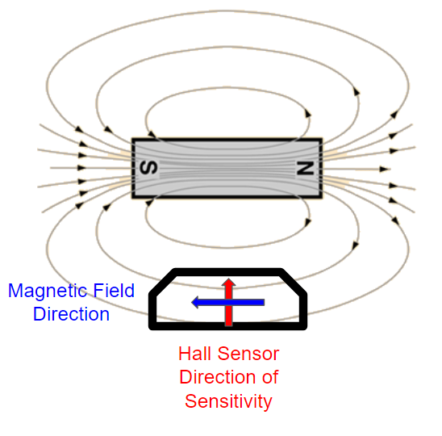
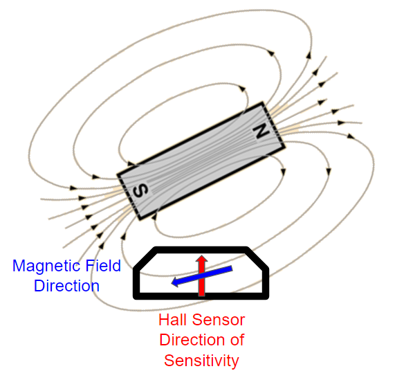
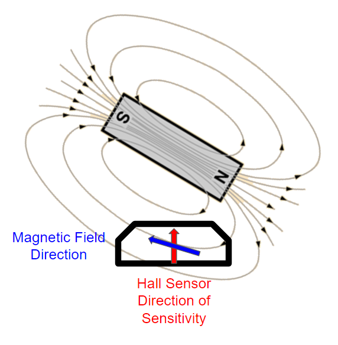

Hall effect sensors work by measuring how hard moving charges get pushed/pulled by a magnetic field. Read more here: https://en.wikipedia.org/wiki/Hall_effect

We can use this effect by attaching a magnet to the stickbox peg in the correct orientation, and placing a sensor underneath it. When the magnetic field is perpendicular to the sensor's direction of sensitivity, no field is detected and the sensor will output ~1V:

When the field tilts one way, the output voltage will decrease:

When the field tilts the other way, the output voltage will increase:

When we glue the magnets on they are not perfectly aligned, so we won't get this perfect behavior, but this is roughly what happens. The microcontroller reads these voltages the same way it does from a potentiometer, but we will need to scale possibly linearize the signal before it can be used to control the stick. The primary advantage is that the Hall effect sensor will not wear out like a potentiometer will. As long as the magnet stays in place it will continue working.

This work is licensed under a [Creative Commons Attribution-ShareAlike 4.0 International License](http://creativecommons.org/licenses/by-sa/4.0/).
